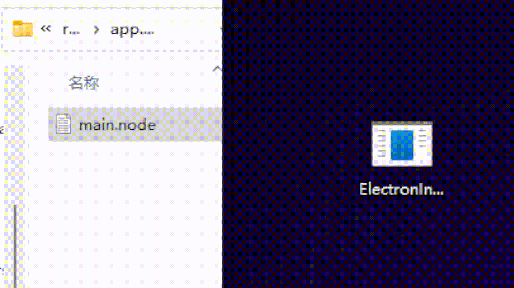

# Electron Injector
[](https://github.com/Yoshino-s/ElectronInjector/actions/workflows/codeql-analysis.yml)


Another injector on encrypted electron app.

## Warning

> Only for study and research. DO NOT USE THIS TOOL FOR CRACKING.

## Feature

- Support Some Software Windows And Linux
- Verified On Some Software v1.0.0 to v1.5.5

## Usage

Download the latest version from release page.

Call it by cmd or just drag the `main.node` onto it.



```
Another injector on encrypted electron app

Usage:
  ElectronInjector [flags]

Flags:
  -h, --help            help for ElectronInjector
  -i, --inject string   Inject file (Internal Payload: hello|dump|crack) (default "crack")
```

## How does it work?

Read this: https://blog.yoshino-s.online/2022/03/31/electron-enc-crack/
